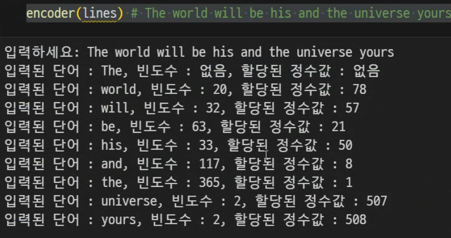
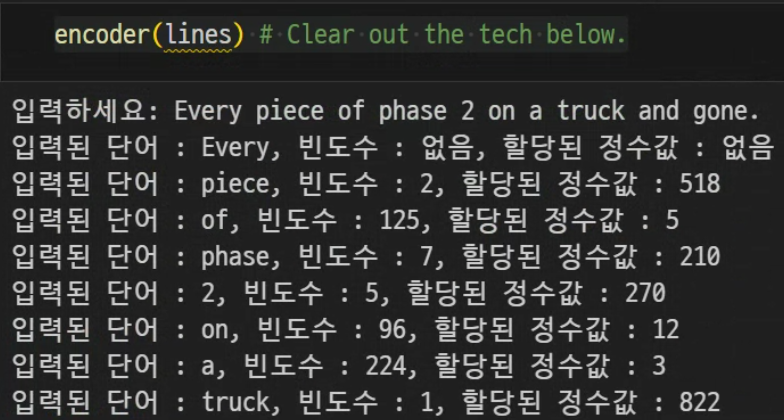
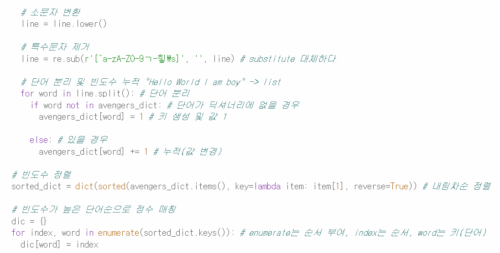
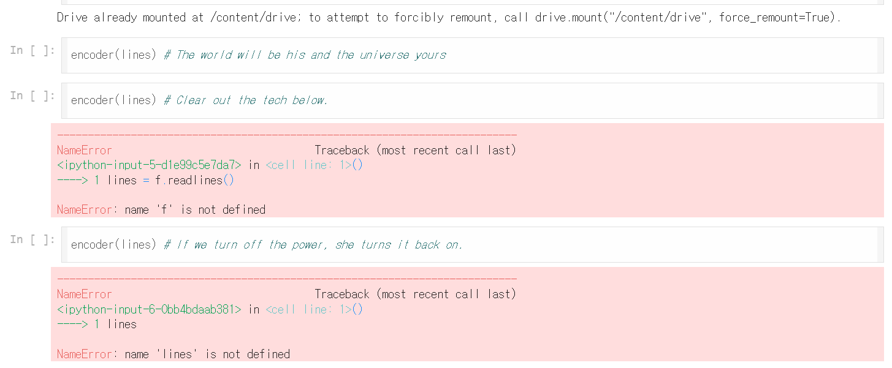

# AIFFEL Campus Online Code Peer Review Templete
- 코더 : 임만순
- 리뷰어 : 최성호


# PRT(Peer Review Template)
- [X]  **1. 주어진 문제를 해결하는 완성된 코드가 제출되었나요?**
    - 문제를 해결하는 완성된 코드가 제출되었습니다.
    
    
    
- [X]  **2. 전체 코드에서 가장 핵심적이거나 가장 복잡하고 이해하기 어려운 부분에 작성된 
주석 또는 doc string을 보고 해당 코드가 잘 이해되었나요?**
    - 문제 해결을 위해 가장 중요한 데이터 전처리 및 빈도수 계산과 그에 따른 내림차순 정렬 기능이 있어 핵심 부분이라고 생각하였습니다.
    - 각 코드에 주석이 작성되어 있어서, 이해하기 쉬웠습니다.
    
        
- [ ]  **3. 에러가 난 부분을 디버깅하여 문제를 해결한 기록을 남겼거나
새로운 시도 또는 추가 실험을 수행해봤나요?**
    - 두 가지의 에러가 있었지만, 그 에러에 관한 정보는 나와있지 않았습니다.
    
        
- [ ]  **4. 회고를 잘 작성했나요?**
    - 아쉽게도, 회고는 기록되어 있지 않았습니다.
        
- [X]  **5. 코드가 간결하고 효율적인가요?**
    - 전체적으로 코드가 간결하게 잘 작성되어 있습니다.
    - 한 문장 안에서 기능을 해결할 수 있는 line들이 많아서 효율적으로 느껴졌습니다.


# 회고(참고 링크 및 코드 개선)
```
빈도수를 정렬하는 부분에서 lambda라는 단어를 처음 봐서 신기했고, 빈도수 정렬과 빈도수가 높은 순서대로 정수를 매칭한다는 부분이 인상깊었습니다.
```
