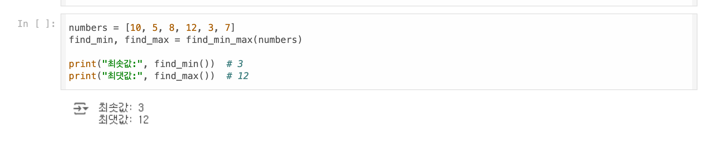
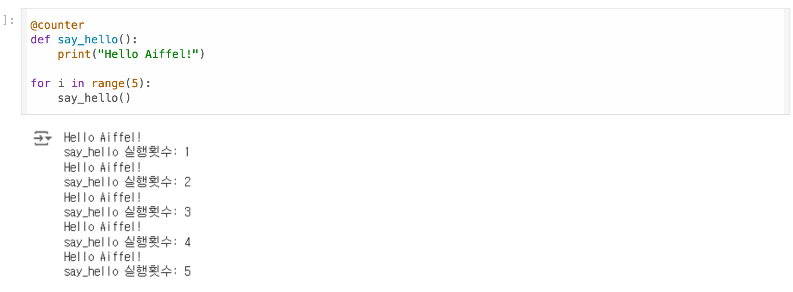

AIFFEL Campus Online Code Peer Review Templete
코더 : 임만순
리뷰어 : 김민규(03)
PRT(Peer Review Template)
 1. 주어진 문제를 해결하는 완성된 코드가 제출되었나요?

주어진 문제를 해결하는 코드가 작성되었습니다.

 2. 전체 코드에서 가장 핵심적이거나 가장 복잡하고 이해하기 어려운 부분에 작성된 주석 또는 doc string을 보고 해당 코드가 잘 이해되었나요?

문제1의 경우 이미 문제에서 주석을 충분히 작성하여 크게 어려운 점은 없었습니다.

문제2의 경우 주석이 필요할 정도까지 복잡한 코드는 아니어서 기본적인 주석만으로 충분하였습니다.

 3. 에러가 난 부분을 디버깅하여 문제를 해결한 기록을 남겼거나 새로운 시도 또는 추가 실험을 수행해봤나요?

디버깅의 흔적은 없었습니다. 

참고로 이번 퀘스트의 경우 ai assistant 를 통해서 많이 지원이 되어서

크게 문제된 부분은 없다고 보입니다.

 4. 회고를 잘 작성했나요?

아무래도 아직 python 학습의 단계인 만큼 아는 점보다 모르는 점이 더 많습니다.

특히 금일 퀘스트의 목표였던 클로져의 경우 사용의 목적, 사용이 필요한 경우 등을

아직 명확히 깨닫지 못하다는 점에서 공감합니다.

 5. 코드가 간결하고 효율적인가요?

코드가 충분히 간결하고 효율적입니다.

파이썬 스타일 가이드 (PEP8) 를 준수하였는지 확인
코드 중복을 최소화하고 범용적으로 사용할 수 있도록 함수화/모듈화했는지 확인
중요! 잘 작성되었다고 생각되는 부분을 캡쳐해 근거로 첨부
회고(참고 링크 및 코드 개선)
# 리뷰어의 회고를 작성합니다.
# 코드 리뷰 시 참고한 링크가 있다면 링크와 간략한 설명을 첨부합니다.
# 코드 리뷰를 통해 개선한 코드가 있다면 코드와 간략한 설명을 첨부합니다.

클로저 사용이 왜 필요한지, 어떠한 상황에서 필요한지, 

정확하게 파이썬 내부에서 어떻게 구현되는지 등 

현재 감이 잘 오지 않는데 저만 그렇게 느낀 것은 아니라는 점에서 안도감을 느낍니다.

추후에도 좀 더 공부해보아야 할 것 같습니다.
